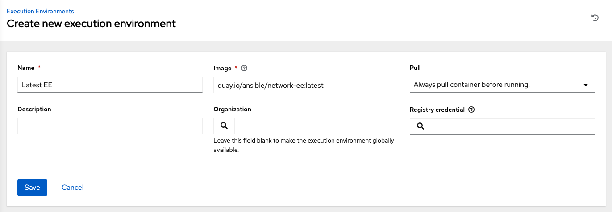

# Execution Environments

The ability to build and deploy Python virtual environments for automation has been replaced by Ansible execution environments. Unlike legacy virtual environments, execution environments are container images that make it possible to incorporate system-level dependencies and collection-based content. Each execution environment allows you to have a customized image to run jobs, and each of them contain only what you need when running the job, nothing more.
## Building an Execution Environment

Using Ansible content that depends on non-default dependencies (custom virtual environments) can be tricky. Packages must be installed on each node, play nicely with other software installed on the host system, and be kept in sync. Previously, jobs ran inside of a virtual environment at /var/lib/awx/venv/ansible by default, which was pre-loaded with dependencies for ansible-runner and certain types of Ansible content used by the Ansible control machine.

To help simplify this process, container images can be built that serve as Ansible control nodes. These container images are referred to as automation execution environments, which you can create with ansible-builder and then ansible-runner can make use of those images.

    ---
    version: 3

    build_arg_defaults:
    ANSIBLE_GALAXY_CLI_COLLECTION_OPTS: '--pre'

    dependencies:
    galaxy: requirements.yml
    python:
        - six
        - psutil
    system: bindep.txt

    images:
    base_image:
        name: registry.redhat.io/ansible-automation-platform-24/ee-minimal-rhel8:latest

    additional_build_files:
        - src: files/ansible.cfg
        dest: configs

    additional_build_steps:
    prepend_galaxy:
        - ADD _build/configs/ansible.cfg ~/.ansible.cfg

    prepend_final: |
        RUN whoami
        RUN cat /etc/os-release
    append_final:
        - RUN echo This is a post-install command!
        - RUN ls -la /etc

## Install ansible-builder

In order to build images, either installations of podman or docker is required along with the ansible-builder Python package. The --container-runtime option needs to correspond to the Podman/Docker executable you intend to use.

Refer to the latest Quickstart for Ansible Builder for detail.
## Build an execution environment

Ansible-builder is used to create an execution environment.

An execution environment is expected to contain:

   - Ansible

   - Ansible Runner

   - Ansible Collections

   - Python and/or system dependencies of:

      - modules/plugins in collections

       - content in ansible-base

       - custom user needs

Building a new execution environment involves a definition (a .yml file) that specifies which content you would like to include in your execution environment, such as collections, Python requirements, and system-level packages. The content from the output generated from migrating to execution environments has some of the required data that can be piped to a file or pasted into this definition file. See Migrate legacy venvs to execution environments for more detail. If you did not migrate from a virtual environment, you can create a definition file with the required data outlined in Execution environment definition.

Collection developers can declare requirements for their content by providing the appropriate metadata. For more information, refer to dependencies.
## Run the builder

Once you created a definition, use this procedure to build your execution environment.

The ansible-builder build command takes an execution environment definition as an input. It outputs the build context necessary for building an execution environment image, and proceeds with building that image. The image can be re-built with the build context elsewhere, and produces the same result. By default, it looks for a file named execution-environment.yml in the current directory.

**For the illustration purposes, the following example execution-environment.yml file is used as a starting point:**

    ---
    version: 3
    dependencies:
    galaxy: requirements.yml

The content of requirements.yml:

    ---
    collections:
    - name: awx.awx

To build an execution environment using the files above, run:

    $ ansible-builder build
...
STEP 7: COMMIT my-awx-ee
    -- 09c930f5f6a
    09c930f5f6ac329b7ddb321b144a029dbbfcc83bdfc77103968b7f6cdfc7bea2
Complete! The build context can be found at: context

In addition to producing a ready-to-use container image, the build context is preserved, which can be rebuilt at a different time and/or location with the tooling of your choice, such as docker build or podman build.

For additional information about the ansible-builder build command, refer to Ansible’s CLI Usage documentation.
## Use an execution environment in jobs

In order to use an execution environment in a job, a few components are required:

   - An execution environment must have been created using ansible-builder. See Build an execution environment for detail. Once an execution environment is created, you can use it to run jobs. Use the automation controller user interface to specify the execution environment to use in your job templates.

   - Depending on whether an execution environment is made available for global use or tied to an organization, you must have the appropriate level of administrator privileges in order to use an execution environment in a job. Execution environments tied to an organization require Organization administrators to be able to run jobs with those execution environments.

   - Before running a job or job template that uses an execution environment that has a credential assigned to it, be sure that the credential contains a username, host, and password.

   - Click Execution Environments from the left navigation bar of the controller user interface.

   - Add an execution environment by selecting the Add button.

   - Enter the appropriate details into the following fields:

   - **Name**: Enter a name for the execution environment (required).

   - **Image**: Enter the image name (required). The image name requires its full location (repo), the registry, image name, and version tag in the example format of quay.io/ansible/awx-ee:latestrepo/project/image-name:tag.

   - **Pull**: optionally choose the type of pull when running jobs:

       - **Always pull container before running**: Pulls the latest image file for the container.

       - **Only pull the image if not present before running**: Only pulls latest image if none specified.

       - **Never pull container before running**: Never pull the latest version of the container image.

   - **Description**: optional.

   - **Organization**: optionally assign the organization to specifically use this execution environment. To make the execution environment available for use across multiple organizations, leave this field blank.

   - **Registry credential**: If the image has a protected container registry, provide the credential to access it.

Click **Save**.

Now your newly added execution environment is ready to be used in a job template. To add an execution environment to a job template, specify it in the **Execution Environment** field of the job template, as shown in the example below. For more information on setting up a job template, see Job Templates in the Automation Controller User Guide.
_images/job-template-with-example-ee-selected.png

Once you added an execution environment to a job template, you can see those templates listed in the Templates tab of the execution environment:
_images/ee-details-templates-list.png

## Execution environment mount options

Rebuilding an execution environment is one way to add certs, but inheriting certs from the host provides a more convenient solution. For VM-based installs, the controller automatically mounts the system trust store in the execution environment when jobs run.

Additionally, you may customize execution environment mount options and mount paths in the Paths to expose to isolated jobs field of the Job Settings page, where it supports podman-style volume mount syntax. Refer to the Podman documentation for detail.

In some cases where the /etc/ssh/* files were added to the execution environment image due to customization of an execution environment, an SSH error may occur. For example, exposing the /etc/ssh/ssh_config.d:/etc/ssh/ssh_config.d:O path allows the container to be mounted, but the ownership permissions are not mapped correctly.

If you encounter this error, or have upgraded from an older version of the controller (e.g. 3.8.x), perform the following steps:

 - Change the container ownership on the mounted volume to root.

 - In the Paths to expose to isolated jobs field of the Job Settings page, using the current example, expose the path as such:

Note

The :O option is only supported for directories. It is highly recommended that you be as specific as possible, especially when specifying system paths. Mounting /etc or /usr directly have impact that make it difficult to troubleshoot.

This informs podman to run a command similar to the example below, where the configuration is mounted and the ssh command works as expected.

    'podman run -v /ssh_config:/etc/ssh/ssh_config.d/:O ...'

To expose isolated paths in OpenShift or Kubernetes containers as HostPath, assume the following configuration:
_images/settings-paths2expose-iso-jobs-mount-containers.png

Use the Expose host paths for Container Groups toggle to enable it.

Once the playbook runs, the resulting Pod spec will display similar to the example below. Note the details of the volumeMounts and volumes sections.
 